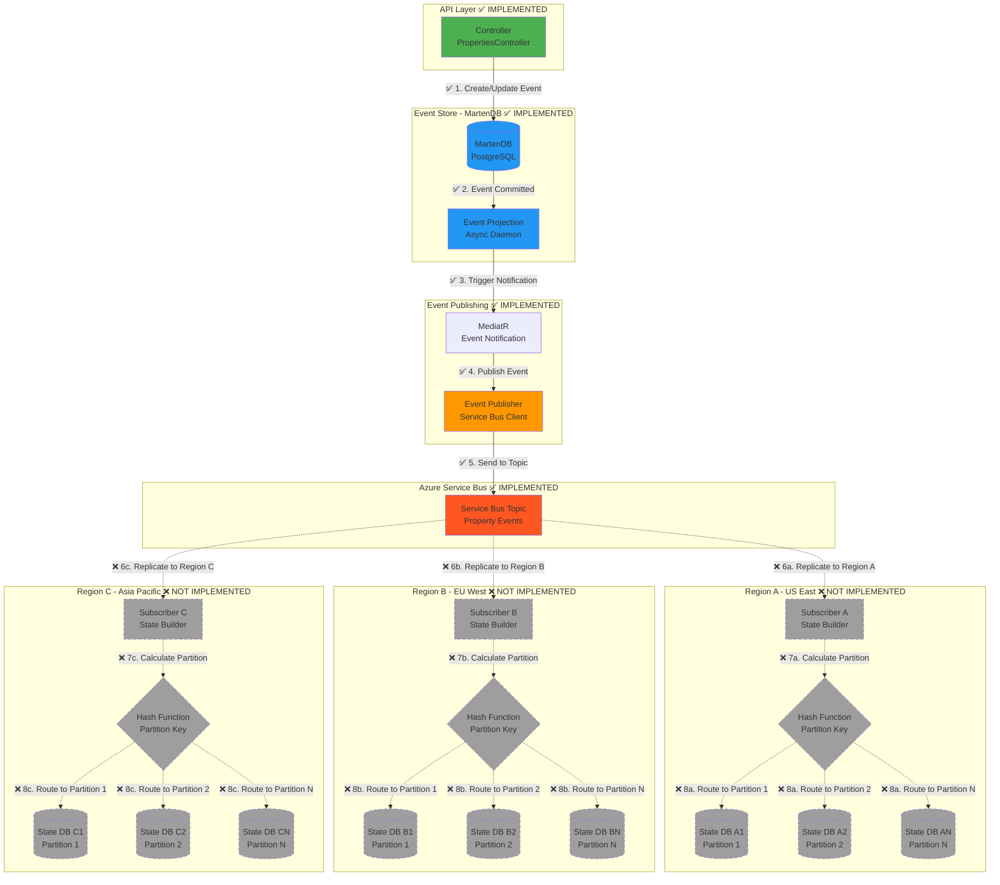

# Event Sourcing Architecture with Azure Service Bus

A .NET 8 event sourcing implementation using MartenDB (PostgreSQL) as the event store and Azure Service Bus for event distribution across geographic regions.

## 📋 Table of Contents

- [Overview](#overview)
- [Architecture](#architecture)
- [Project Structure](#project-structure)
- [Technologies](#technologies)
- [Current Implementation Status](#current-implementation-status)
- [Getting Started](#getting-started)
- [API Endpoints](#api-endpoints)
- [Future Enhancements](#future-enhancements)

## 🎯 Overview

This project implements an event sourcing pattern where domain events are stored in an append-only event store (MartenDB/PostgreSQL) and published to Azure Service Bus for consumption by regional subscribers. The architecture is designed to support:

- **Event Sourcing**: All state changes are captured as immutable events
- **Geographic Distribution**: Events replicated to multiple regions
- **Horizontal Scalability**: Data partitioning within each region
- **Low Latency**: Regional state databases for fast queries

## 🏗️ Architecture



### Flow Description

**✅ Implemented (Steps 1-5):**
1. **Controller** receives HTTP requests and creates/updates domain entities
2. **MartenDB** stores events in PostgreSQL event store (append-only)
3. **Event Projection** (Async Daemon) detects committed events
4. **MediatR** notification pattern triggers event handlers
5. **Event Publisher** sends events to Azure Service Bus Topic

**❌ Not Yet Implemented (Steps 6-8):**
6. **Regional Subscribers** consume events from Service Bus in each geographic region
7. **Hash Function** distributes data across partitioned databases within each region
8. **State Databases** store materialized views for low-latency queries

## 📁 Project Structure

```
EventSourcing/
├── API/                              # Web API Layer
│   ├── Controllers/
│   │   └── PropertiesController.cs  # Property CRUD endpoints
│   └── Program.cs                    # Application startup
│
├── Domain/                           # Domain Models & Events
│   ├── Domains/
│   │   └── Property.cs               # Property aggregate
│   ├── Events/
│   │   ├── EventMessage.cs
│   │   └── Property/
│   │       ├── PropertyCreate.cs     # Property creation event
│   │       └── PropertyUpdate.cs     # Property update event
│   ├── Interfaces/
│   │   ├── IDomainEvent.cs           # Base domain event interface
│   │   └── IEventPublisher.cs        # Event publisher contract
│   ├── Options/
│   │   ├── EventStoreOptions.cs
│   │   └── ServiceBusOptions.cs
│   └── EventNotification.cs
│
├── EventStore/                       # Event Store Implementation
│   ├── MartenDB/
│   │   └── MartenStore.cs            # MartenDB configuration
│   ├── EventProjection.cs            # Async event projection
│   └── ServiceBuilder.cs
│
└── Services/                         # Event Publishing Services
    ├── Handler/
    │   ├── PropertyCreateEventPublisher.cs
    │   ├── PropertyCreateEventSubscriber.cs
    │   ├── PropertyUpdateEventPublisher.cs
    │   └── PropertyUpdateEventSubscriber.cs
    ├── EventPublisher.cs             # Azure Service Bus publisher
    ├── LocalEventPublisher.cs
    ├── LocalEventSubscriber.cs
    └── ServiceBuilder.cs
```

## 🛠️ Technologies

- **.NET 8** - Latest .NET framework
- **ASP.NET Core Web API** - RESTful API
- **MartenDB** - PostgreSQL-based event store
- **PostgreSQL** - Event persistence database
- **Azure Service Bus** - Message broker for event distribution
- **MediatR** - In-process messaging for event notifications
- **JasperFx** - Event projection and async daemon

## ✅ Current Implementation Status

### Implemented Features

- ✅ **Property Domain Model** - Core aggregate with create/update operations
- ✅ **Event Store** - MartenDB integration with PostgreSQL
- ✅ **Event Sourcing** - Domain events persisted as immutable facts
- ✅ **Event Projection** - Async daemon for event processing
- ✅ **Event Publishing** - Azure Service Bus integration
- ✅ **MediatR Integration** - Event notification pipeline
- ✅ **REST API** - CRUD endpoints for properties

### Event Types

- `PropertyCreate` - Raised when a new property is created
- `PropertyUpdate` - Raised when a property is updated

### Endpoints

- `POST /api/properties` - Create a new property
- `PUT /api/properties/{id}` - Update an existing property
- `GET /api/properties/{id}` - Get property by ID
- `GET /api/properties` - Get all properties

## 🚀 Getting Started

### Prerequisites

- .NET 8 SDK
- PostgreSQL 12+
- Azure Service Bus namespace and topic

### Configuration

Update `appsettings.json` with your connection strings:

```json
{
  "EventStore": {
    "ConnectionString": "Host=localhost;Database=property_store;Username=postgres;Password=your_password"
  },
  "ServiceBus": {
    "PropertyEventTopic": "property-events",
    "PropertyEventConnectionString": "Endpoint=sb://your-namespace.servicebus.windows.net/;SharedAccessKeyName=..."
  }
}
```

### Running the Application

1. **Restore dependencies:**
   ```bash
   dotnet restore
   ```

2. **Build the solution:**
   ```bash
   dotnet build
   ```

3. **Run the API:**
   ```bash
   cd API
   dotnet run
   ```

4. **Access Swagger UI:**
   ```
   https://localhost:5001/swagger
   ```

## 📡 API Endpoints

### Create Property

```http
POST /api/properties
Content-Type: application/json

{
  "address": "123 Main St, New York, NY",
  "ownerName": "John Doe",
  "price": 500000
}
```

### Update Property

```http
PUT /api/properties/{id}
Content-Type: application/json

{
  "address": "123 Main St, New York, NY",
  "ownerName": "Jane Doe",
  "price": 550000
}
```

### Get Property

```http
GET /api/properties/{id}
```

### Get All Properties

```http
GET /api/properties
```

## 🔮 Future Enhancements

### Phase 1: Regional Subscribers (Not Implemented)
- [ ] Implement Service Bus subscription listeners per region
- [ ] Deploy subscriber services in multiple Azure regions
- [ ] Add health checks and monitoring

### Phase 2: Data Partitioning (Not Implemented)
- [ ] Design partition key strategy (Property ID, Tenant ID, etc.)
- [ ] Implement hash function for data distribution
- [ ] Create routing logic to target appropriate state database

### Phase 3: State Database Layer (Not Implemented)
- [ ] Set up regional state databases (SQL, CosmosDB, etc.)
- [ ] Implement state projection/materialization logic
- [ ] Build query APIs for state databases
- [ ] Add caching layer for frequently accessed data

### Phase 4: Geo-Replication
- [ ] Configure cross-region replication
- [ ] Implement conflict resolution strategies
- [ ] Add geo-routing for client requests
- [ ] Performance testing and optimization

### Phase 5: Observability
- [ ] Add distributed tracing (Application Insights, OpenTelemetry)
- [ ] Event processing metrics and dashboards
- [ ] Alerting for event processing failures
- [ ] Dead letter queue monitoring

## 📝 Key Design Decisions

### Event Store
- **MartenDB** chosen for PostgreSQL-native event sourcing capabilities
- Events stored in append-only fashion for complete audit trail
- Async projections process events without blocking writes

### Event Publishing
- **Azure Service Bus Topics** for fan-out pattern
- Enables multiple regional subscribers
- At-least-once delivery semantics

### Regional Architecture
- **Level 1**: Geographic replication across regions (US, EU, APAC)
- **Level 2**: Horizontal partitioning within each region
- Benefits: low latency, high availability, scalability

## 🤝 Contributing

1. Fork the repository
2. Create a feature branch
3. Commit your changes
4. Push to the branch
5. Create a Pull Request

## 👥 Authors

Your Name - Initial work

## 🙏 Acknowledgments

- MartenDB for excellent event sourcing support
- Azure Service Bus for reliable messaging
- MediatR for in-process event handling
