# Event Sourcing Architecture with Azure Service Bus

A .NET 8 event sourcing implementation using MartenDB (PostgreSQL) as the event store and Azure Service Bus for event distribution across geographic regions.

## 📋 Table of Contents

- [Overview](#overview)
- [Architecture](#architecture)
- [Project Structure](#project-structure)
- [Technologies](#technologies)
- [Current Implementation Status](#current-implementation-status)
- [Getting Started](#getting-started)
- [API Endpoints](#api-endpoints)
- [Future Enhancements](#future-enhancements)

## 🎯 Overview

This project implements an event sourcing pattern where domain events are stored in an append-only event store (MartenDB/PostgreSQL) and published to Azure Service Bus for consumption by regional subscribers. The architecture is designed to support:

- **Event Sourcing**: All state changes are captured as immutable events
- **Geographic Distribution**: Events replicated to multiple regions
- **Horizontal Scalability**: Data partitioning within each region
- **Low Latency**: Regional state databases for fast queries

## 🏗️ Architecture

```mermaid
graph TB
    subgraph "API Layer ✅ IMPLEMENTED"
        Controller[Controller<br/>PropertiesController]
    end
    
    subgraph "Event Store - MartenDB ✅ IMPLEMENTED"
        Marten[(MartenDB<br/>PostgreSQL)]
        EventProjection[Event Projection<br/>Async Daemon]
    end
    
    subgraph "Event Publishing ✅ IMPLEMENTED"
        MediatR[MediatR<br/>Event Notification]
        EventPublisher[Event Publisher<br/>Service Bus Client]
    end
    
    subgraph "Azure Service Bus ✅ IMPLEMENTED"
        Topic[Service Bus Topic<br/>Property Events]
    end
    
    subgraph "Region A - US East ❌ NOT IMPLEMENTED"
        SubA[Subscriber A<br/>State Builder]
        HashA{Hash Function<br/>Partition Key}
        StateA1[(State DB A1<br/>Partition 1)]
        StateA2[(State DB A2<br/>Partition 2)]
        StateAN[(State DB AN<br/>Partition N)]
        GraphQLA[GraphQL Service A<br/>Query Layer]
    end
    
    subgraph "Region B - EU West ❌ NOT IMPLEMENTED"
        SubB[Subscriber B<br/>State Builder]
        HashB{Hash Function<br/>Partition Key}
        StateB1[(State DB B1<br/>Partition 1)]
        StateB2[(State DB B2<br/>Partition 2)]
        StateBN[(State DB BN<br/>Partition N)]
        GraphQLB[GraphQL Service B<br/>Query Layer]
    end
    
    subgraph "Region C - Asia Pacific ❌ NOT IMPLEMENTED"
        SubC[Subscriber C<br/>State Builder]
        HashC{Hash Function<br/>Partition Key}
        StateC1[(State DB C1<br/>Partition 1)]
        StateC2[(State DB C2<br/>Partition 2)]
        StateCN[(State DB CN<br/>Partition N)]
        GraphQLC[GraphQL Service C<br/>Query Layer]
    end
    
    Controller -->|✅ 1. Create/Update Event| Marten
    Marten -->|✅ 2. Event Committed| EventProjection
    EventProjection -->|✅ 3. Trigger Notification| MediatR
    MediatR -->|✅ 4. Publish Event| EventPublisher
    EventPublisher -->|✅ 5. Send to Topic| Topic
    
    Topic -.->|❌ 6a. Replicate to Region A| SubA
    Topic -.->|❌ 6b. Replicate to Region B| SubB
    Topic -.->|❌ 6c. Replicate to Region C| SubC
    
    SubA -.->|❌ 7a. Calculate Partition| HashA
    SubB -.->|❌ 7b. Calculate Partition| HashB
    SubC -.->|❌ 7c. Calculate Partition| HashC
    
    HashA -.->|❌ 8a. Route to Partition 1| StateA1
    HashA -.->|❌ 8a. Route to Partition 2| StateA2
    HashA -.->|❌ 8a. Route to Partition N| StateAN
    
    HashB -.->|❌ 8b. Route to Partition 1| StateB1
    HashB -.->|❌ 8b. Route to Partition 2| StateB2
    HashB -.->|❌ 8b. Route to Partition N| StateBN
    
    HashC -.->|❌ 8c. Route to Partition 1| StateC1
    HashC -.->|❌ 8c. Route to Partition 2| StateC2
    HashC -.->|❌ 8c. Route to Partition N| StateCN
    
    StateA1 -.->|❌ 9a. Query Data| GraphQLA
    StateA2 -.->|❌ 9a. Query Data| GraphQLA
    StateAN -.->|❌ 9a. Query Data| GraphQLA
    
    StateB1 -.->|❌ 9b. Query Data| GraphQLB
    StateB2 -.->|❌ 9b. Query Data| GraphQLB
    StateBN -.->|❌ 9b. Query Data| GraphQLB
    
    StateC1 -.->|❌ 9c. Query Data| GraphQLC
    StateC2 -.->|❌ 9c. Query Data| GraphQLC
    StateCN -.->|❌ 9c. Query Data| GraphQLC
    
    style Controller fill:#4CAF50
    style Marten fill:#2196F3
    style EventProjection fill:#2196F3
    style EventPublisher fill:#FF9800
    style Topic fill:#FF5722
    
    style SubA fill:#9E9E9E,stroke-dasharray: 5 5
    style SubB fill:#9E9E9E,stroke-dasharray: 5 5
    style SubC fill:#9E9E9E,stroke-dasharray: 5 5
    
    style HashA fill:#9E9E9E,stroke-dasharray: 5 5
    style HashB fill:#9E9E9E,stroke-dasharray: 5 5
    style HashC fill:#9E9E9E,stroke-dasharray: 5 5
    
    style StateA1 fill:#9E9E9E,stroke-dasharray: 5 5
    style StateA2 fill:#9E9E9E,stroke-dasharray: 5 5
    style StateAN fill:#9E9E9E,stroke-dasharray: 5 5
    style StateB1 fill:#9E9E9E,stroke-dasharray: 5 5
    style StateB2 fill:#9E9E9E,stroke-dasharray: 5 5
    style StateBN fill:#9E9E9E,stroke-dasharray: 5 5
    style StateC1 fill:#9E9E9E,stroke-dasharray: 5 5
    style StateC2 fill:#9E9E9E,stroke-dasharray: 5 5
    style StateCN fill:#9E9E9E,stroke-dasharray: 5 5
    
    style GraphQLA fill:#9E9E9E,stroke-dasharray: 5 5
    style GraphQLB fill:#9E9E9E,stroke-dasharray: 5 5
    style GraphQLC fill:#9E9E9E,stroke-dasharray: 5 5
```



### Flow Description

**✅ Implemented (Steps 1-5):**
1. **Controller** receives HTTP requests and creates/updates domain entities
2. **MartenDB** stores events in PostgreSQL event store (append-only)
3. **Event Projection** (Async Daemon) detects committed events
4. **MediatR** notification pattern triggers event handlers
5. **Event Publisher** sends events to Azure Service Bus Topic

**❌ Not Yet Implemented (Steps 6-8):**
6. **Regional Subscribers** consume events from Service Bus in each geographic region
7. **Hash Function** distributes data across partitioned databases within each region
8. **State Databases** store materialized views for low-latency queries
9. **GraphQL Services** provide efficient query layer for accessing regional state databases

## 📁 Project Structure

```
EventSourcing/
├── API/                              # Web API Layer
│   ├── Controllers/
│   │   └── PropertiesController.cs  # Property CRUD endpoints
│   └── Program.cs                    # Application startup
│
├── Domain/                           # Domain Models & Events
│   ├── Domains/
│   │   └── Property.cs               # Property aggregate
│   ├── Events/
│   │   ├── EventMessage.cs
│   │   └── Property/
│   │       ├── PropertyCreate.cs     # Property creation event
│   │       └── PropertyUpdate.cs     # Property update event
│   ├── Interfaces/
│   │   ├── IDomainEvent.cs           # Base domain event interface
│   │   └── IEventPublisher.cs        # Event publisher contract
│   ├── Options/
│   │   ├── EventStoreOptions.cs
│   │   └── ServiceBusOptions.cs
│   └── EventNotification.cs
│
├── EventStore/                       # Event Store Implementation
│   ├── MartenDB/
│   │   └── MartenStore.cs            # MartenDB configuration
│   ├── EventProjection.cs            # Async event projection
│   └── ServiceBuilder.cs
│
└── Services/                         # Event Publishing Services
    ├── Handler/
    │   ├── PropertyCreateEventPublisher.cs
    │   ├── PropertyCreateEventSubscriber.cs
    │   ├── PropertyUpdateEventPublisher.cs
    │   └── PropertyUpdateEventSubscriber.cs
    ├── EventPublisher.cs             # Azure Service Bus publisher
    ├── LocalEventPublisher.cs
    ├── LocalEventSubscriber.cs
    └── ServiceBuilder.cs
```

## 🛠️ Technologies

- **.NET 8** - Latest .NET framework
- **ASP.NET Core Web API** - RESTful API
- **MartenDB** - PostgreSQL-based event store
- **PostgreSQL** - Event persistence database
- **Azure Service Bus** - Message broker for event distribution
- **MediatR** - In-process messaging for event notifications
- **JasperFx** - Event projection and async daemon

## ✅ Current Implementation Status

### Implemented Features

- ✅ **Property Domain Model** - Core aggregate with create/update operations
- ✅ **Event Store** - MartenDB integration with PostgreSQL
- ✅ **Event Sourcing** - Domain events persisted as immutable facts
- ✅ **Event Projection** - Async daemon for event processing
- ✅ **Event Publishing** - Azure Service Bus integration
- ✅ **MediatR Integration** - Event notification pipeline
- ✅ **REST API** - CRUD endpoints for properties

### Event Types

- `PropertyCreate` - Raised when a new property is created
- `PropertyUpdate` - Raised when a property is updated

### Endpoints

- `POST /api/properties` - Create a new property
- `PUT /api/properties/{id}` - Update an existing property

## 🚀 Getting Started

### Prerequisites

- .NET 8 SDK
- PostgreSQL 12+
- Azure Service Bus namespace and topic

### Configuration

Update `appsettings.json` with your connection strings:

```json
{
  "EventStore": {
    "ConnectionString": "Host=localhost;Database=property_store;Username=postgres;Password=your_password"
  },
  "ServiceBus": {
    "PropertyEventTopic": "property-events",
    "PropertyEventConnectionString": "Endpoint=sb://your-namespace.servicebus.windows.net/;SharedAccessKeyName=..."
  }
}
```

### Running the Application

1. **Restore dependencies:**
   ```bash
   dotnet restore
   ```

2. **Build the solution:**
   ```bash
   dotnet build
   ```

3. **Run the API:**
   ```bash
   cd API
   dotnet run
   ```

4. **Access Swagger UI:**
   ```
   https://localhost:5001/swagger
   ```

## 📡 API Endpoints

### Create Property

```http
POST /api/properties
Content-Type: application/json

{
  "address": "123 Main St, New York, NY",
  "ownerName": "John Doe",
  "price": 500000
}
```

### Update Property

```http
PUT /api/properties/{id}
Content-Type: application/json

{
  "address": "123 Main St, New York, NY",
  "ownerName": "Jane Doe",
  "price": 550000
}
```

### Get Property

```http
GET /api/properties/{id}
```

### Get All Properties

```http
GET /api/properties
```

## � Querying State Databases

Once the regional state databases are built and materialized views are established, the recommended approach for querying data is to use a **GraphQL service** rather than traditional REST endpoints.

### Why GraphQL?

- **Precise Data Fetching**: Clients request only the fields they need, reducing bandwidth and improving performance
- **Single Endpoint**: One GraphQL endpoint can serve multiple query patterns
- **Strongly Typed**: Schema provides clear contracts and excellent tooling support
- **Efficient Joins**: Fetch related data in a single request without multiple round trips
- **Regional Optimization**: GraphQL resolvers can efficiently query partitioned state databases

### Example GraphQL Query (Future Implementation)

```graphql
query GetProperty($id: ID!) {
  property(id: $id) {
    id
    address
    ownerName
    price
    lastUpdated
  }
}

query SearchProperties($filter: PropertyFilter) {
  properties(filter: $filter) {
    edges {
      node {
        id
        address
        price
      }
    }
  }
}
```

This approach separates the **command** path (write operations through Event Store) from the **query** path (read operations through GraphQL and state databases), following the CQRS pattern.

## �🔮 Future Enhancements

### Phase 1: Regional Subscribers (Not Implemented)
- [ ] Implement Service Bus subscription listeners per region
- [ ] Deploy subscriber services in multiple Azure regions
- [ ] Add health checks and monitoring

### Phase 2: Data Partitioning (Not Implemented)
- [ ] Design partition key strategy (Property ID, Tenant ID, etc.)
- [ ] Implement hash function for data distribution
- [ ] Create routing logic to target appropriate state database

### Phase 3: State Database Layer (Not Implemented)
- [ ] Set up regional state databases (SQL, CosmosDB, etc.)
- [ ] Implement state projection/materialization logic
- [ ] Build GraphQL service for querying state databases (recommended)
- [ ] Add caching layer for frequently accessed data

> **💡 Recommendation:** Once the state databases are built and populated with materialized views, it is recommended to use a **GraphQL service** for querying data. GraphQL provides flexible, efficient queries with precise field selection, reducing over-fetching and enabling clients to request exactly the data they need from the regional state databases.

### Phase 4: Geo-Replication
- [ ] Configure cross-region replication
- [ ] Implement conflict resolution strategies
- [ ] Add geo-routing for client requests
- [ ] Performance testing and optimization

### Phase 5: Observability
- [ ] Add distributed tracing (Application Insights, OpenTelemetry)
- [ ] Event processing metrics and dashboards
- [ ] Alerting for event processing failures
- [ ] Dead letter queue monitoring

## 📝 Key Design Decisions

### Event Store
- **MartenDB** chosen for PostgreSQL-native event sourcing capabilities
- Events stored in append-only fashion for complete audit trail
- Async projections process events without blocking writes

### Event Publishing
- **Azure Service Bus Topics** for fan-out pattern
- Enables multiple regional subscribers
- At-least-once delivery semantics

### Regional Architecture
- **Level 1**: Geographic replication across regions (US, EU, APAC)
- **Level 2**: Horizontal partitioning within each region
- Benefits: low latency, high availability, scalability

## 🤝 Contributing

1. Fork the repository
2. Create a feature branch
3. Commit your changes
4. Push to the branch
5. Create a Pull Request

## 👥 Authors

Rex Ph

## 🙏 Acknowledgments

- MartenDB for excellent event sourcing support
- Azure Service Bus for reliable messaging
- MediatR for in-process event handling
